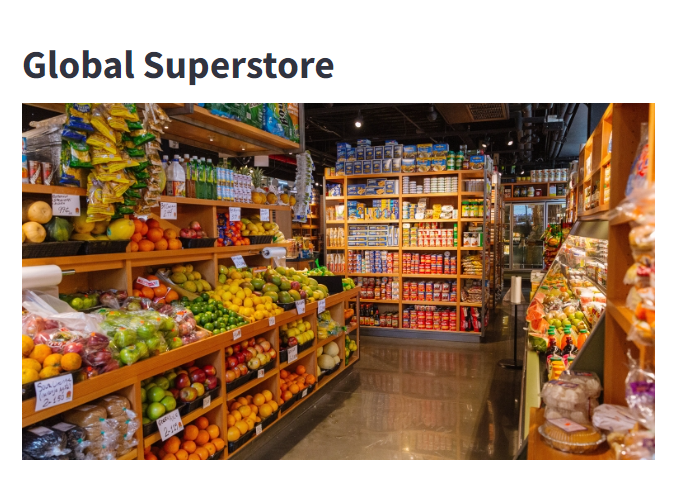
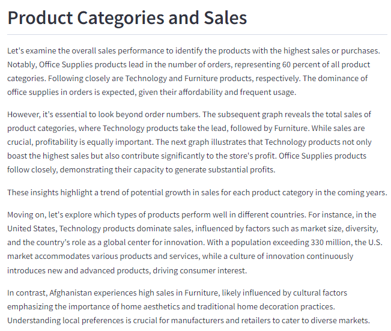
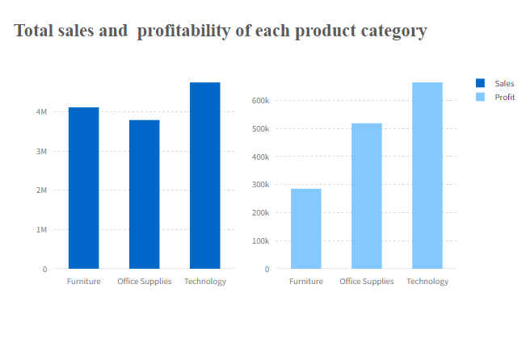
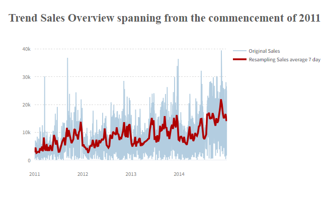

# **Project : Global Store Analysis**

In this comprehensive project, I engaged in an extensive Exploratory Data Analysis (EDA) of a prominent global superstore, meticulously dissecting its performance from the inception of 2011 to the culmination of 2014. This multifaceted analysis encompasses a diverse array of critical domains, offering a nuanced perspective on the store's operations and market dynamics.

**1. Product Categories and Sales:**

- Scrutinizing the sales landscape for each distinct product category across a myriad of countries, unraveling intricate patterns and trends.
- Identifying countries where particular products exhibit exceptional sales, affording insights into regional preferences and demands.
- Delving beyond mere sales figures, a profound examination of the profitability associated with each product type was undertaken, shedding light on the financial intricacies of the superstore's diverse inventory.

**2. Customer Analysis:**

- Unraveling the tapestry of customer behavior, the analysis endeavors to pinpoint the customer segments contributing significantly to overall sales.
- In-depth exploration of customer behavior, including order frequency, provides actionable intelligence for orchestrating targeted promotions and campaigns, ensuring optimal efficiency in marketing endeavors.

**3. Order Placements and Trends:**

- A meticulous exploration of trends in order placements, dissecting data to discern peak ordering times and align business strategies accordingly.
- The temporal evolution of sales and profit dynamics was meticulously studied, offering a temporal narrative that aids in understanding the store's financial trajectory over each year.

**4. Market Growth and Region:**

- A panoramic examination of market conditions in each distinct region, shedding light on the complex interplay of regional economies and consumer behaviors.
- Pinpointing profitable product types within specific regions, the analysis extends beyond mere sales statistics, delving into the underlying factors driving success in diverse markets.
- A granular exploration of market share dynamics and growth percentages in each region from 2011 to 2014 provides a historical context, offering valuable insights into the store's global expansion and regional market penetration.

This project, with its comprehensive scope and analytical depth, not only showcases adept data analysis skills but also underscores the practical utility of derived insights in shaping strategic decisions for the global superstore's sustained success. Your feedback is highly welcomed, and I remain open to further refinements to meet your specific requirements.

### **How to use**
1. Open the command prompt (cmd) and navigate to the folder where you want to store the project. For example, use the following command: cd 'path/to/your/directory'
2. Clone the project repository by entering the command: git clone https://github.com/alexday11/analysis-global-store.git
3. Move into the project directory: cd 'analysis-global-store'
4. Start the app by running the following command: streamlit run app.py
